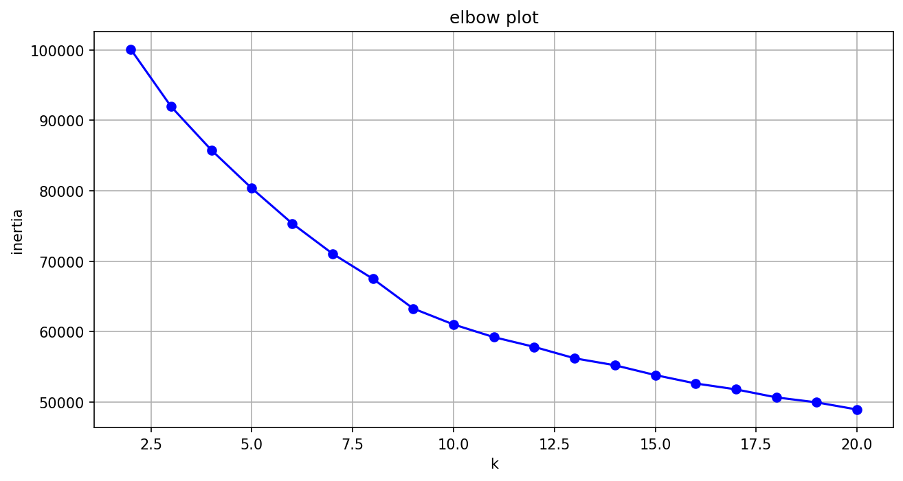
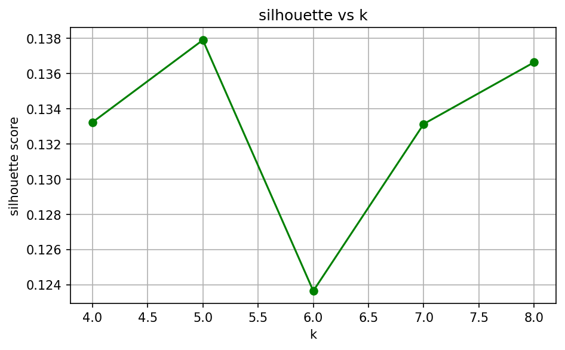
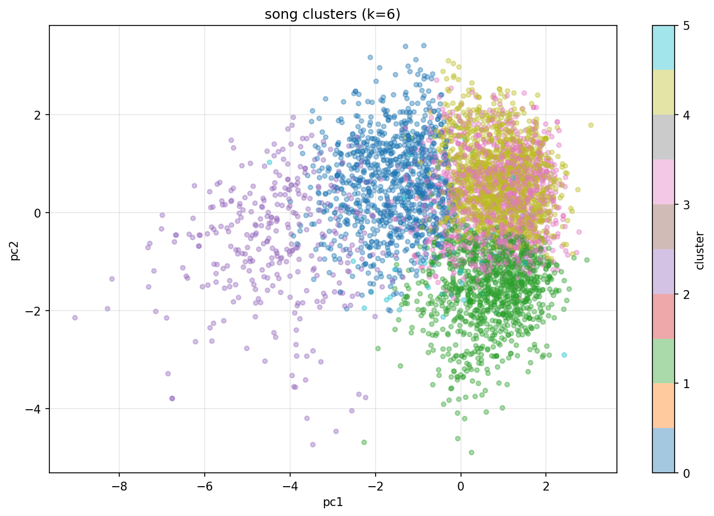

# Spotify Song Clustering

A small ML project where I grouped songs from Spotify based on
their audio features and built a simple recommendation system
on top of it.

# What I Did

I took 10,000 songs and clustered them into 6 groups using
KMeans. Songs in the same group tend to sound similar in
terms of energy, danceability, mood, etc. Then I made a
function where you type a song name and it gives you back
other songs from the same cluster.

I picked k=6 after trying the elbow method and silhouette
scores. It seemed like the sweet spot.

# Plots

Elbow plot to figure out how many clusters to use:

Silhouette scores for extra validation:

PCA plot of the clusters. Since we have 12 features and
this is only 2D, there is some overlap:

# Example

If you input "Blinding Lights" it gives you songs like
505 by Arctic Monkeys, Back In Black by AC/DC, and
Unstoppable by Sia. All high energy tracks.

# Features I Used

danceability, energy, key, loudness, mode, speechiness,
acousticness, instrumentalness, liveness, valence, tempo,
and time_signature.

I tried including duration_ms at first but it kind of ruined
the clusters so I dropped it.

# Dataset

From Kaggle. The full one has around 100k songs but I used
a 10k sample for this project.

# Running It

Install the requirements and run the file:

pip install -r requirements.txt

python spotify_clustering.py

# Built With

Python, pandas, scikit-learn, matplotlib